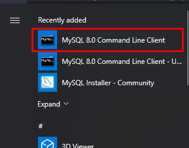

[← Pagina Inicial](../../README.md)

<h1 align="center">Instalando o MySQL Server<h1>

## Windowns

1. Acesse esse [site](https://dev.mysql.com/downloads/installer/) e baixe a versão mais leve

2. Apos baixar abra o instalador.

3. Selecione a opção 'Server Only', avance e execute.

4. Em seguida avance até aparecer para você escolher sua senha.

5. Depois escolher sua senha avançe até finalizar a instalação.

6. Para abrir é muito simples, apenas clique no command line:

## Linux

EM BREVE!

## Mac

EM BREVE!

[← Pagina Inicial](../../README.md)