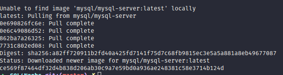
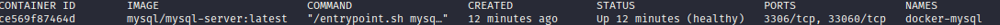
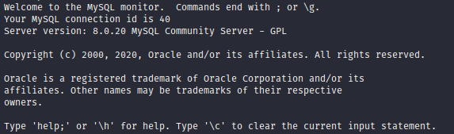

[← Pagina Inicial](../../README.md#--)

<h1 align="center">Instalando o MySQL Server</h1>

## Windowns

1. Acesse esse [site](https://dev.mysql.com/downloads/installer/) e baixe a versão mais leve

2. Apos baixar abra o instalador.

3. Selecione a opção 'Server Only', avance e execute.

4. Em seguida avance até aparecer para você escolher sua senha.

5. Depois escolher sua senha avançe até finalizar a instalação.

6. Para abrir é muito simples, apenas clique no command line:

<h1 align="center"></h1>

## Linux

EM BREVE!

## Mac

EM BREVE!

## Docker
1. Caso não tenha o docker instaldo em sua maquina vá até o site e siga à [documentação](https://docs.docker.com/get-docker/) para instalação.

2. Com o docker instalado em sua maquina, use o comando `# docker run --name sql4nobs-mysql -e MYSQL_ROOT_PASSWORD=suasenha -d mysql/mysql-server:latest`, para fazer o download da imagem do `Mysql`.
Obs:
`--name sql4nobs-mysql`: É o nome dado ao container você pode escolher um de sua preferência ou pode deixar o proprio docker se encarrregar disso.
`MYSQL_ROOT_PASSWORD=suasenha`: É a senha que será usada para entrar no container e execultar comandos sql.
`mysql/mysql-server:latest`: É a imagem do mysql que será usada no container. A tag `latest` siguinifica que é a ultima imagem que foi lançada.

3. Se tudo estiver ok, você verá um log similar a esse.

<h1 align="center"></h1>

4. Use o comando `docker ps` para verificar se o container está rodando em sua maquina.

<h1 align="center"></h1>

5. Para entrar no container use o comando `docker exec -it docker-mysql bash`.

6. Dentro do container use o comando `mysql -u root -p`. Em seguida deve aparecer `Enter password:` então você coloca a senha que voçê definiu em ``MYSQL_ROOT_PASSWORD=suasenha`.

7. Feito isso deve parecer o seguinte logo para você.

<h1 align="center"></h1>

[← Pagina Inicial](../../README.md#--)